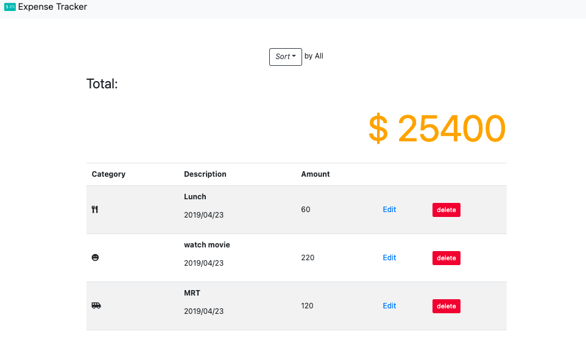

# Expense Tracker

## Features
- There are 5 default expenses
- You can add expenses 
- You can click `edit` to edit expenses
- You can click `delete` to delete expenses
- You can use `sort` to find related expenses

## What I used
- express: 4.17.1, express-handlebars: 5.3.3, method-override: 3.0.0, moment: 2.29.1
- Bootstrap, jQuery, Popper.js and Font Awesome
- mongoose 6.0.1

## How to Use
- git clone 
- open your terminal
- `cd` to expense-tracker file
- type `npm install`
- type `npm run seed` to create default data
- type `npm run dev` to start 
- You will see `running on http://localhost:3000` 
- Input http://localhost:3000 on your browser 
